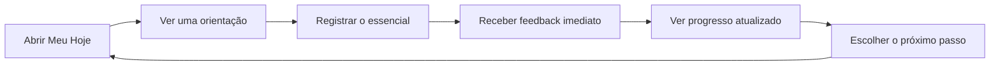
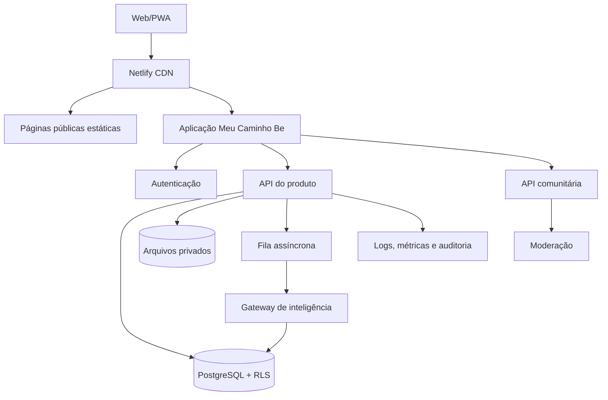
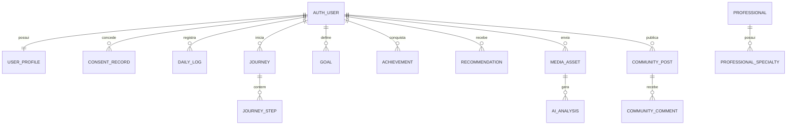

# Meu Caminho Be 2.0

## Especificação de produto, experiência e arquitetura

Status: proposta para implementação incremental
Última revisão: 22 de julho de 2026
Princípio de migração: preservar o produto atual e substituir partes somente quando a nova camada estiver validada.

## 1. Decisão de produto

O **Meu Caminho Be** será o núcleo do BeMEsportivo: um sistema de jornada esportiva personalizada que ajuda cada pessoa a registrar seu momento, enxergar sua evolução e decidir um próximo passo possível.

Ele não será médico, nutricionista ou treinador. Será o **GPS da jornada esportiva**:

- organiza informações fornecidas pela própria pessoa;
- oferece educação e caminhos possíveis;
- reconhece constância sem incentivar excesso;
- conecta a conteúdos e profissionais adequados;
- explica por que cada orientação está sendo mostrada;
- nunca apresenta diagnóstico, liberação clínica ou prescrição individual.

Proposta de valor:

> Você registra. O BeM organiza, explica e ajuda você a continuar.

Missão da marca:

> Conectar pessoas para fortalecer a prática esportiva.

Propósito:

> O esporte começa nas pessoas.

## 2. O que já existe e deve ser preservado

A versão atual já contém uma base útil e não deve ser descartada:

- Mapa BeM e perfil esportivo;
- triagem educacional de contexto e segurança;
- Meu Hoje com atividade, duração, sensação, sono, água e alimentação;
- resumo diário e semanal;
- Jornada da Semana;
- descoberta de modalidade;
- XP, níveis, medalhas e sequência;
- ferramentas, conteúdos e profissionais recomendados;
- exportação, importação e exclusão dos dados locais;
- PWA instalável;
- comunidade e comentários globais;
- design system e padrões de feedback.

Limitações estruturais atuais:

- o perfil e o diário ficam apenas no `localStorage` do aparelho;
- não existe uma identidade autenticada única;
- a comunidade usa um armazenamento global sem vínculo seguro com uma conta;
- o armazenamento comunitário é um único documento e não é adequado para consultas relacionais, concorrência elevada ou dados sensíveis;
- não existe fila de processamento para análises de IA;
- a personalização atual é um motor de regras no navegador, não um serviço versionado e auditável;
- não existe console operacional para moderação, profissionais ou atendimento aos direitos do titular.

## 3. O núcleo do hábito

O produto deve responder em menos de dez segundos:

1. Como estou hoje?
2. O que vale registrar agora?
3. Qual é o meu próximo passo?
4. O que mudou desde ontem ou desde a semana passada?

O loop diário recomendado é:



O retorno diário não deve depender de culpa, medo ou perda artificial. A motivação será construída com:

- progresso visível;
- pequenas ações concluíveis;
- mensagens específicas, não genéricas;
- sequência flexível, com dias de descanso válidos;
- novidade controlada, com uma recomendação por vez;
- histórico pessoal que se torna mais útil com o tempo.

## 4. Escopo do MVP seguro

### Deve entrar no primeiro lançamento autenticado

- conta por e-mail com código ou link de acesso;
- aceite separado de termos, privacidade e tratamento de dados opcionais;
- migração voluntária do perfil local para a conta;
- sincronização de perfil, Meu Hoje, Jornada da Semana e conquistas;
- dashboard diário com uma ação principal;
- registro essencial em até dois minutos;
- resumo da semana atualizado automaticamente;
- regras de recomendação explicáveis e versionadas;
- exportação e exclusão da conta e dos dados;
- eventos de produto sem texto livre ou informação de saúde;
- proteção contra abuso, limitação de requisições e logs de auditoria;
- acessibilidade por teclado, leitores de tela e redução de movimento.

### Pode entrar após validar o hábito

- metas configuráveis;
- desafios individuais;
- calendário e gráficos mensais;
- notificações opt-in;
- feed de conquistas compartilhadas;
- perfis profissionais verificados;
- perguntas e respostas moderadas;
- análise de foto limitada a identificação de contexto e registro confirmado pelo usuário.

### Piloto atual de análise visual

O Meu Hoje possui um piloto sem armazenamento de imagens. A foto é reduzida no navegador, enviada somente após consentimento específico e usada para produzir observação prudente, incentivo, pergunta de contexto e texto inicial. O resultado não altera o diário sozinho: a pessoa precisa revisar e confirmar antes de salvar localmente.

O piloto bloqueia reconhecimento de pessoas, inferências sensíveis, diagnóstico, prescrição, avaliação definitiva de técnica e estimativas precisas de nutrientes ou calorias. A liberação pública depende da configuração segura dos segredos, avaliação do fornecedor e teste operacional documentado.

### Não deve entrar no MVP

- diagnóstico ou avaliação de lesão;
- liberação para atividade física;
- prescrição de treino, dieta ou tratamento;
- estimativa precisa de calorias, nutrientes ou composição corporal por foto;
- correção técnica definitiva por uma única imagem;
- ranking que premie volume, peso perdido ou intensidade;
- comparação pública de saúde, corpo ou desempenho entre pessoas;
- feed aberto sem identidade, moderação e denúncia operacionais;
- coleta de localização contínua;
- uso secundário de fotos ou dados de saúde para publicidade.

## 5. Arquitetura de informação e mapa de telas

```text
Meu Caminho Be
├── Meu Hoje
│   ├── orientação do momento
│   ├── check-in rápido
│   ├── registro completo opcional
│   └── resumo do dia
├── Minha Jornada
│   ├── missão atual
│   ├── Jornada da Semana
│   ├── trilhas
│   └── desafios individuais
├── Minha Evolução
│   ├── semana
│   ├── mês
│   ├── sequência
│   └── conquistas
├── Explorar
│   ├── conteúdos
│   ├── ferramentas
│   ├── modalidades
│   └── profissionais
├── Comunidade
│   ├── relatos
│   ├── perguntas e respostas
│   └── conquistas compartilhadas
└── Minha Conta
    ├── perfil esportivo
    ├── preferências
    ├── privacidade e consentimentos
    ├── exportar dados
    └── excluir conta
```

No mobile, a navegação principal terá no máximo cinco destinos:

1. Hoje
2. Jornada
3. Evolução
4. Explorar
5. Perfil

Comunidade aparece dentro de Explorar até comprovar uso recorrente suficiente para merecer um item próprio.

## 6. Wireframes funcionais

### 6.1 Meu Hoje — mobile

```text
┌──────────────────────────────────┐
│ BeM                    [avatar]  │
│ Bom dia, João                    │
│ Terça, 22 de julho               │
├──────────────────────────────────┤
│      60% da meta semanal         │
│  3 dias registrados · 4 de XP   │
├──────────────────────────────────┤
│ PRÓXIMO PASSO                    │
│ Registre como está seu dia       │
│ [ Registrar Meu Hoje ]           │
├──────────────────────────────────┤
│ ORIENTAÇÃO DE AGORA              │
│ Uma ação curta e explicável      │
│ [Fazer agora] [Lembrar depois]   │
├──────────────────────────────────┤
│ Último registro   Sequência      │
│ Caminhada 30 min  4 dias         │
└──────────────────────────────────┘
 Hoje  Jornada  Evolução  Explorar
```

### 6.2 Check-in progressivo

Primeiro mostra somente o essencial:

- data;
- atividade ou descanso;
- tempo aproximado;
- como a pessoa se sentiu.

Depois oferece “Adicionar detalhes” para sono, água, refeições e observações. Salvar o essencial já conclui o check-in.

### 6.3 Feedback após salvar

```text
┌──────────────────────────────────┐
│ ✓ Seu dia foi registrado         │
│ +15 XP · sequência de 4 dias     │
│ Sua semana agora está em 60%.    │
│                                  │
│ O que este dia mostra            │
│ Você manteve sua constância.     │
│                                  │
│ [Ver resumo] [Continuar jornada] │
└──────────────────────────────────┘
```

O feedback deve sempre conter: confirmação, mudança gerada e próximo passo. Não mostrar prêmio aleatório sem relação com a ação.

### 6.4 Desktop

No desktop, manter menu lateral e usar três camadas:

- faixa principal: saudação, progresso semanal e ação do dia;
- faixa de decisão: próximo passo e orientação;
- faixa de contexto: último registro, sequência, evolução e recomendações.

## 7. Fluxos por momento de uso

### Primeiro acesso

1. Explicar o benefício antes de pedir dados.
2. Permitir experimentar localmente ou criar conta.
3. Pedir apenas nome, faixa etária, objetivo, experiência e tempo disponível.
4. Apresentar consentimentos específicos quando um dado sensível for realmente necessário.
5. Gerar o primeiro Mapa BeM.
6. Direcionar para um primeiro Meu Hoje, sem formulário longo.
7. Entregar uma pequena conclusão e uma missão possível.

Sexo, peso, altura, alimentação, limitação e dados clínicos não são obrigatórios para criar a primeira experiência. Cada pergunta deve informar finalidade, benefício e consequência de não responder.

### Primeira semana

- meta padrão: três check-ins, incluindo descanso;
- uma missão simples;
- resumo semanal no sétimo dia ou após três registros;
- convite para configurar notificações apenas depois de a pessoa perceber valor;
- nenhuma comparação social automática.

### Primeiro mês

- mostrar tendências descritivas, não conclusões clínicas;
- permitir criar uma meta mensal;
- sugerir uma ferramenta ou conteúdo com justificativa;
- perguntar se a recomendação ajudou;
- oferecer conexão com profissional quando o contexto exigir acompanhamento.

### Primeiro ano

- retrospectiva por períodos;
- ciclos iniciados e concluídos;
- modalidades experimentadas;
- padrões de constância e interrupção;
- conquistas pessoais;
- exportação em formato legível e estruturado.

## 8. Arquitetura técnica de transição

O site institucional e as reportagens continuam estáticos, rápidos e indexáveis. O Meu Caminho Be ganha uma camada de aplicação autenticada sem reescrever a home ou as páginas públicas.



### Estratégia recomendada

- **Agora:** HTML/CSS/JavaScript modular existentes, PWA e Netlify para o front público.
- **MVP autenticado:** Supabase Auth + PostgreSQL + Row Level Security; Netlify Functions como API para operações privilegiadas.
- **Arquivos:** Storage privado com políticas por usuário e URLs temporárias.
- **Processamento demorado:** Background Functions ou fila gerenciada, sempre fora da requisição principal.
- **IA:** gateway server-side independente do fornecedor, com versões de prompt, políticas, limites, auditoria e fallback para regras.
- **Analytics:** eventos pseudonimizados; nenhum campo de texto livre, foto, sintoma ou refeição em ferramentas de marketing.

O Netlify Blobs atual continua atendendo comentários públicos durante a transição. Ele não será o banco do perfil, diário ou dados relacionados à saúde. A própria documentação da Netlify direciona casos com consultas complexas, concorrência ou relações para bancos especializados.

## 9. Modelo de dados

Todas as tabelas privadas usam `user_id`, Row Level Security e timestamps. Identificadores são UUIDs; datas diárias usam o fuso escolhido pelo usuário.



### Tabelas essenciais do MVP

| Tabela | Finalidade | Dados principais |
|---|---|---|
| `user_profiles` | identidade de produto | nome de exibição, fuso, cidade opcional, preferências |
| `sport_profiles` | contexto esportivo | faixa etária, objetivo, experiência, disponibilidade, modalidade |
| `consent_records` | prova de consentimento | finalidade, versão, estado, data, origem |
| `daily_logs` | Meu Hoje | data local, atividade, minutos, sensação e campos opcionais |
| `journeys` | ciclos da jornada | tipo, início, fim, estado e versão do modelo |
| `journey_steps` | etapas e check-ins | ordem, estado, resposta e conclusão |
| `goals` | metas pessoais | tipo, alvo, período e estado |
| `activity_events` | histórico imutável | evento, origem, data e metadados mínimos |
| `xp_ledger` | contabilidade de XP | motivo, pontos, idempotency key e data |
| `recommendations` | recomendação auditável | regra, versão, motivo, conteúdo e resposta do usuário |
| `notification_preferences` | escolha do usuário | canal, horário, frequência e opt-in |
| `data_requests` | direitos LGPD | acesso, correção, exportação ou exclusão e estado |

### Dados posteriores

- `media_assets` e `ai_analyses` somente na fase de IA visual;
- `community_posts`, `follows`, `reactions` e `reports` somente com moderação operacional;
- `professionals`, `verifications`, `appointments` e `specialties` somente após critérios jurídicos e comerciais.

### Regras de modelagem

- diário e perfil nunca compartilham tabela com conteúdo comunitário;
- XP usa um ledger, não um número editável no perfil;
- consentimento é versionado e não é sobrescrito;
- exclusão lógica só é usada quando houver obrigação de retenção documentada;
- texto livre recebe limite, sanitização e classificação de risco;
- registros derivados guardam `source`, `rule_version` e `created_at`;
- recomendações não alteram dados fornecidos pelo usuário.

## 10. Contrato inicial de API

```text
GET    /api/v2/me
PATCH  /api/v2/me/profile
GET    /api/v2/me/consents
POST   /api/v2/me/consents
GET    /api/v2/daily-logs?from=&to=
POST   /api/v2/daily-logs
PATCH  /api/v2/daily-logs/:id
DELETE /api/v2/daily-logs/:id
GET    /api/v2/dashboard
GET    /api/v2/journeys/current
POST   /api/v2/journeys/:id/steps/:stepId/complete
GET    /api/v2/recommendations/today
POST   /api/v2/recommendations/:id/feedback
POST   /api/v2/data-requests/export
POST   /api/v2/data-requests/delete
```

Requisitos de todas as mutações:

- autenticação;
- autorização por usuário;
- validação de esquema;
- limite de tamanho;
- chave de idempotência;
- limitação de frequência;
- registro de auditoria sem conteúdo sensível;
- resposta de erro segura e compreensível.

## 11. Motor de recomendação

### Nível 1 — regras explicáveis

É o nível adequado ao MVP. Combina:

- objetivo declarado;
- experiência;
- disponibilidade;
- preferências;
- registros recentes;
- conclusão das missões;
- contexto de segurança.

Cada saída contém:

```json
{
  "recommendation_type": "next_action",
  "message_key": "daily_log_missing",
  "reason": "Você ainda não registrou o dia de hoje.",
  "action": "open_daily_log",
  "rule_version": "2026-07-01",
  "safety_class": "educational"
}
```

### Nível 2 — personalização estatística

Usa agregados e feedback do usuário para ordenar conteúdos e horários. Não toma decisões clínicas e não usa categorias sensíveis para publicidade.

### Nível 3 — IA generativa controlada

A IA recebe somente o mínimo necessário, produz resposta estruturada e passa por políticas antes de chegar ao usuário. Sempre deve:

- separar observação de inferência;
- apresentar incerteza;
- evitar diagnóstico e prescrição;
- oferecer saída segura quando houver sinais de atenção;
- explicar que dado influenciou a resposta;
- permitir contestação e feedback;
- registrar versão e resultado da análise.

## 12. IA visual

### Fluxo permitido

1. Usuário escolhe uma foto e vê a finalidade.
2. Sistema remove metadados EXIF quando não forem necessários.
3. Arquivo é enviado para área privada com expiração configurada.
4. Modelo classifica a cena: refeição, academia, corrida, futebol, bicicleta, medalha ou outro.
5. Resposta começa com “Parece...” e apresenta confiança limitada.
6. Sistema faz no máximo duas perguntas para completar o contexto.
7. Usuário confirma ou corrige tudo antes de salvar no diário.
8. Foto é excluída conforme a escolha e a política de retenção.

### Exemplos seguros

- “Parece haver arroz, frango e vegetais. Não é possível confirmar ingredientes, quantidades ou nutrientes apenas pela foto.”
- “A cena parece ser uma academia. Qual atividade você fez?”
- “Parece uma corrida ao ar livre. Deseja registrar distância e duração?”
- “Parece uma medalha. Deseja adicionar o evento ao seu histórico?”

### Limites obrigatórios

- não inferir doença, deficiência, raça, religião, orientação sexual ou estado emocional pela aparência;
- não identificar pessoas ou fazer reconhecimento facial;
- não estimar peso, percentual de gordura ou calorias com aparência de precisão;
- não avaliar execução técnica sem protocolo validado e confirmação profissional;
- não usar fotos privadas para treinar modelos sem consentimento separado e inequívoco;
- não tornar a foto pública por padrão.

## 13. Gamificação responsável

XP representa participação no processo, não superioridade esportiva.

| Ação | XP sugerido | Limite |
|---|---:|---|
| concluir perfil inicial | 40 | uma vez |
| primeiro Meu Hoje | 20 | uma vez |
| registrar um dia | 15 | uma vez por data |
| concluir missão | 25 | uma vez por etapa |
| revisar a semana | 30 | uma vez por semana |
| experimentar modalidade | 30 | mediante confirmação |
| ajudar na comunidade | 10 | após moderação, com teto diário |

Não premiar:

- menos peso;
- mais dor;
- maior intensidade;
- treino em sequência sem descanso;
- volume ilimitado;
- postagem repetitiva;
- comparação corporal.

Sequência saudável:

- qualquer check-in válido conta, inclusive descanso;
- uma “pausa consciente” pode preservar a sequência;
- não usar mensagens de perda ou vergonha;
- oferecer recuperação de sequência como retomada, não como compra.

## 14. Comunidade e profissionais

### Comunidade

Antes de ampliar o feed, são necessários:

- conta e idade mínima definida;
- termos comunitários;
- denúncia, bloqueio e recurso;
- moderação humana com fila e SLA;
- filtros de spam, assédio e informação perigosa;
- privacidade por publicação;
- exclusão e exportação;
- controles especiais para menores;
- plano de resposta a incidentes.

O primeiro formato social deve ser **compartilhar conquista opcional**, não um feed irrestrito. O usuário escolhe o que publicar; diário, sono, alimentação e sintomas permanecem privados.

### Profissionais

O selo BeM exige:

- identidade verificada;
- conselho e registro profissional quando aplicável;
- especialidade e limites de atuação;
- política de atualização cadastral;
- canal de denúncia;
- indicação clara de conteúdo patrocinado;
- critérios públicos, auditáveis e sem promessa de resultado.

Agenda e pagamento devem ser uma etapa posterior à validação do diretório e do processo de verificação.

## 15. LGPD, segurança e responsabilidade

Dados de saúde são dados pessoais sensíveis. Sintomas, lesões, alimentação associada ao usuário e inferências podem exigir proteção especial. Antes da sincronização em nuvem:

1. definir controlador, operadores e encarregado/canal de privacidade;
2. mapear finalidade e base legal de cada campo;
3. aplicar necessidade e minimização;
4. elaborar avaliação de risco e, quando adequado, RIPD;
5. separar consentimentos por finalidade;
6. documentar retenção e descarte;
7. firmar instrumentos com operadores;
8. implantar resposta a incidentes;
9. permitir informação, acesso, correção, exportação, revogação e exclusão;
10. submeter textos e fluxos a revisão jurídica brasileira.

Controles técnicos mínimos:

- TLS em trânsito e criptografia em repouso;
- RLS em todas as tabelas expostas;
- chave administrativa somente no servidor;
- MFA para administradores;
- segredos fora do repositório;
- backups testados;
- logs sem payload sensível;
- proteção CSRF quando aplicável;
- CSP antes de liberar upload e IA;
- validação de tipo real de arquivo, tamanho e malware;
- URLs assinadas e curtas para mídia privada;
- rate limiting por usuário e risco;
- testes automatizados de isolamento entre contas;
- ambientes separados para desenvolvimento, homologação e produção.

O consentimento atual do navegador não deve ser reaproveitado silenciosamente para a nuvem. A migração exige novo aviso e decisão explícita.

## 16. Design system do produto

O design system existente continua como base. Para o 2.0, os componentes precisam ter contrato de comportamento, acessibilidade e estados.

### Tokens

- cores semânticas: `primary`, `secondary`, `surface`, `background`, `success`, `warning`, `danger`, `info`;
- tipografia: display, título, corpo, legenda e dado numérico;
- espaçamento em escala de 4 px;
- radius por função, não por página;
- elevation em três níveis discretos;
- duração e easing de movimento;
- foco visível e contraste;
- temas claro e alto contraste antes de um tema escuro completo.

### Componentes prioritários

- `AppShell`;
- `BottomNavigation` e `SideNavigation`;
- `TodayHero`;
- `ProgressRing`;
- `NextActionCard`;
- `DailyCheckIn`;
- `InsightCard`;
- `FeedbackToast` e `FeedbackSummary`;
- `JourneyTimeline`;
- `MetricCard`;
- `AchievementBadge`;
- `RecommendationCard`;
- `ConsentNotice`;
- `EmptyState`, `LoadingState` e `ErrorState`;
- `PrivacyControl`;
- `ReportDialog`.

Todos devem prever: padrão, hover, foco, ativo, carregando, sucesso, erro, desabilitado e vazio.

## 17. Métricas do produto

### Métrica norte

**Semanas úteis por pessoa:** percentual de usuários ativos que completam ao menos três registros e visualizam o resumo semanal.

### Ativação

- concluiu perfil mínimo;
- recebeu primeiro mapa;
- salvou primeiro Meu Hoje;
- entendeu o próximo passo;
- retornou em até sete dias.

### Retenção

- D1, D7, D30 e semana 8;
- check-ins por pessoa ativa;
- semanas com resumo consultado;
- missões iniciadas e concluídas;
- retorno após uma semana interrompida.

### Qualidade e confiança

- recomendações marcadas como úteis;
- correções feitas pelo usuário em análises;
- taxa de exclusão e revogação;
- tempo de resposta a solicitações de privacidade;
- incidentes e denúncias;
- falhas de isolamento por usuário: meta zero;
- acessibilidade e sucesso por tipo de dispositivo.

### Eventos permitidos

```text
dashboard_viewed
daily_log_started
daily_log_saved
weekly_summary_viewed
journey_step_completed
recommendation_opened
recommendation_feedback_sent
consent_updated
data_export_requested
account_deletion_requested
```

Os eventos usam IDs pseudônimos e propriedades enumeradas. Nunca enviar refeição, observação, sintoma, foto ou resposta livre para analytics.

## 18. Roadmap

### Fase 0 — preparação e validação (2 a 3 semanas)

- aprovar esta especificação;
- inventariar todos os campos atuais;
- definir responsável por produto, privacidade e segurança;
- entrevistar 8 a 12 pessoas do público-alvo;
- medir o funil local existente;
- testar o protótipo de Meu Hoje e resumo semanal;
- decidir fornecedor de identidade e banco;
- criar modelo de ameaça e plano de migração.

Critério de saída: usuários entendem o valor e completam o check-in essencial sem ajuda.

### MVP — conta e sincronização (6 a 10 semanas)

- autenticação sem senha;
- banco e RLS;
- perfil mínimo;
- migração local voluntária;
- Meu Hoje sincronizado;
- dashboard e resumo semanal;
- Jornada da Semana;
- XP ledger;
- exportar e excluir;
- analytics seguro;
- testes de acesso entre contas.

Critério de saída: nenhum dado de um usuário pode ser acessado por outro e o fluxo principal funciona em dois aparelhos.

### Versão 1.0 — hábito e evolução (6 a 8 semanas)

- metas;
- calendário e gráficos;
- notificações opt-in;
- desafios individuais;
- recomendações com feedback;
- modo offline com fila de sincronização;
- painel operacional mínimo.

Critério de saída: retenção D30 e semanas úteis demonstram valor recorrente.

### Versão 2.0 — inteligência e conexão (8 a 12 semanas)

- IA visual em beta fechado;
- pipeline assíncrono;
- moderação de segurança;
- conquistas compartilháveis;
- diretório de profissionais verificados;
- comunidade limitada e moderada.

Critério de saída: precisão percebida, segurança, custo por análise e operação de moderação dentro das metas.

### Versão 3.0 — ecossistema

- jornadas colaborativas com profissionais;
- integrações consentidas com dispositivos;
- marketplace/agenda após validação regulatória;
- comunidade por modalidade e cidade;
- modelos de recomendação mais personalizados;
- infraestrutura multi-região conforme uso real.

## 19. Caminho para um milhão de usuários

Um milhão de cadastros não exige microserviços no primeiro dia. Exige fronteiras corretas, observabilidade e capacidade de evolução.

### Até 10 mil usuários

- aplicação modular;
- PostgreSQL gerenciado;
- RLS;
- funções serverless;
- storage privado;
- jobs assíncronos;
- índices e backups;
- monitoramento de erro e custo.

### De 10 mil a 100 mil

- pool de conexões;
- cache de leitura não sensível;
- processamento de mídia desacoplado;
- tabelas de eventos particionadas quando necessário;
- busca dedicada se consultas justificarem;
- moderação e suporte com ferramentas internas;
- testes de carga baseados no comportamento real.

### De 100 mil a 1 milhão

- filas com retry, idempotência e dead-letter queue;
- limites de orçamento por IA e usuário;
- réplicas de leitura e estratégia regional conforme latência;
- agregados pré-calculados para dashboards;
- versionamento de APIs e eventos;
- times e responsabilidades por domínio;
- disaster recovery testado;
- revisão contínua de privacidade e segurança.

Não migrar prematuramente para microserviços. Separar primeiro os domínios no código: identidade, jornada, registros, recomendação, gamificação, comunidade, profissionais e privacidade.

## 20. Prioridades executivas

### P0 — antes de sincronizar qualquer dado

- identidade;
- modelo de dados;
- RLS e testes de isolamento;
- consentimentos e política de retenção;
- exportação e exclusão;
- revisão jurídica;
- separação total entre privado e comunidade.

### P1 — cria valor recorrente

- Meu Hoje rápido;
- dashboard;
- resumo semanal;
- próximo passo;
- metas e sequência saudável;
- feedback imediato.

### P2 — aumenta personalização

- notificações;
- gráficos;
- desafios;
- recomendação com feedback;
- conteúdo e profissionais contextualizados.

### P3 — aumenta complexidade e risco

- fotos e IA visual;
- comunidade social;
- agenda;
- pagamentos;
- integrações de dispositivos;
- ranking público.

## 21. Critérios de sucesso do produto 2.0

O produto estará pronto para lançamento quando:

- uma pessoa entende por que voltar amanhã;
- o primeiro check-in leva até dois minutos;
- toda ação relevante devolve confirmação, mudança e próximo passo;
- o dashboard é útil sem exigir dados sensíveis;
- os dados sincronizam entre aparelhos sem duplicação;
- nenhuma conta acessa dados privados de outra;
- o usuário consegue corrigir, exportar e excluir seus dados;
- recomendações mostram motivo e limite;
- descanso é reconhecido como parte da jornada;
- a interface funciona por teclado, leitor de tela e mobile;
- há responsável e processo para privacidade, incidentes e moderação;
- IA e comunidade podem ser desligadas sem quebrar o Meu Hoje.

## 22. Próxima implementação recomendada

Não começar pela IA visual nem por um feed. O próximo pacote de desenvolvimento deve ser:

1. especificar o esquema SQL e as políticas RLS;
2. criar autenticação em ambiente de homologação;
3. implementar migração opt-in do perfil local;
4. sincronizar `user_profiles`, `sport_profiles` e `daily_logs`;
5. testar conta A versus conta B;
6. adaptar o dashboard atual para leitura local + remota;
7. só então liberar a conta sincronizada para um pequeno grupo.

## 23. Referências oficiais para a decisão técnica

- [Supabase Auth](https://supabase.com/docs/guides/auth)
- [Supabase Row Level Security](https://supabase.com/docs/guides/database/postgres/row-level-security)
- [Supabase Storage Access Control](https://supabase.com/docs/guides/storage/security/access-control)
- [Netlify Blobs](https://docs.netlify.com/build/data-and-storage/netlify-blobs/)
- [Netlify Background Functions](https://docs.netlify.com/build/functions/background-functions/)
- [ANPD — Titular de Dados](https://www.gov.br/anpd/pt-br/assuntos/titular-de-dados-1)
- [ANPD — Direitos dos Titulares](https://www.gov.br/anpd/pt-br/assuntos/titular-de-dados-1/direito-dos-titulares)
- [ANPD — Glossário](https://www.gov.br/anpd/pt-br/documentos-e-publicacoes/glossario-anpd)

Esta especificação orienta produto e engenharia, mas não substitui avaliação jurídica, clínica, de segurança da informação ou dos respectivos conselhos profissionais.
